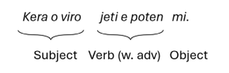

# What is Ijunta?

## Origins

Ijunta is a microlanguage which takes inspiration from several sources,
most notably Mini (invented by S.C. Gruget in 2020) as well as Toki
Pona, Latin, Manmino, and Interlingua.

Approximately 50% of the vocabulary is drawn from Mini, with almost all
of the remainder derived from classical Latin and (occasionally)
Proto-Indo-European roots.

## Purpose

With a target base vocabulary of under 1000 words, Ijunta has several
goals:

-   An aesthetically pleasing language to write, read, and speak

-   A compact vocabulary that is easy to memorise and learn

-   A flexible but simple system of affixes to express nuanced, socially
    robust meanings

-   Easy pronunciation, using only common consonants and a simple 5
    vowel system with no diphthongs and limited hiatus

# Basics

## Phonotactics

Ijunta words use a (C)V(C) syllabic structure, where the final C may
only be **m** or **n**. The only vowel combinations that may appear
adjacent to each other are **eo**, **ia**, **io**, **ua**, **ui**, and
**uo**, all of which are pronounced syllabically with hiatus rather than
as diphthongs.

All vowel length is non-contrastive but should be pronounced short
wherever comfortable to do so. The vowels **a**, **o**, and **u** tend
to be pronounced slightly longer in stressed syllables, while **e** and
**i** are almost always short.

While Ijunta includes both **l** and **r**, they are not used in minimal
pairs and in practice are interchangeable without loss of meaning.
Similarly, while the official pronunciation of **j** is /dʒ/, some
speakers may find it more comfortable to pronounce these words using /j/
and should still be intelligible to other speakers if they do so.

## Alphabet

Ijunta is written using the following letters of the standard Latin
alphabet. The IPA pronunciation for the neutral dialect of Ijunta is
shown below each character:

| **Character** | a   | b   | d   | e   | f   | g   | i   | j   | k   | l   |
|---------------|-----|-----|-----|-----|-----|-----|-----|-----|-----|-----|
| **IPA**       | ä   | b   | d   | e̞   | f   | g   | ɪ   | dʒ  | k   | l   |
| **Character** | m   | n   | o   | p   | r   | s   | t   | u   | v   |     |
| **IPA**       | m   | n   | o̞   | p   | ɹ   | s/z | t   | ʉ   | v   |     |

Note that the vowels for Ijunta tend to be quite centered, and \[s\] is
generally allophonically pronounced /z/ following an \[o\].

## Basics of word order

Sentences and clauses in Ijunta are arranged in subject-verb-object
(SVO) order.

Since most words may be flexibly used in multiple parts of speech, the
meaning of words must be inferred through position and context. The word
immediately following the subject noun phrase is always assumed to be a
verb unless a subject complement is used as a copula.

The two primary complements are:

| **Ijunta** | **Function** |
|-----------------|-------------------------------------------------------|
| *a* | Marks the next word / phrase as a noun complement. |
| *e* | Marks the next word / phrase as an adjective when following a noun, or as an adverb when following a verb. |

The meaning of a phrase can change substantially depending on whether a
complement marker is present and if so, which one is used:

| **Ijunta**            | **Translation**            |
|-----------------------|----------------------------|
| *Animale manja.*      | The animal eats.           |
| *Animale a manja.*    | The animal is food.        |
| *Da animale e manja.* | That is an edible animal.  |
| *Animale manja veji.* | The animal eats the plant. |
| *Di duro melanje.*    | This hardens the mixture.  |
| *Da e duro.*          | That (thing) is durable.   |
| *Da a duro.*          | That is hard (difficult).  |
| *A vasa.*             | There is water.            |
| *E vasa.*             | It’s wet.                  |

Further description of the use of these words is found in following
sections.

The use of **o** marks the next word as the owner in an associative
relationship with the preceding noun or attributional adjectives:

| **Ijunta**                       | **Translation**                   |
|----------------------------------|-----------------------------------|
| *Mi aroma pan.*                  | I smell bread.                    |
| *Mi amo aroma o pan.*            | I like the smell of the bread.    |
| *Viro jeti e duro kon sio kera.* | The man hits hard with his stick. |
| *Kera o viro jeti e duro mi.*    | The man’s stick hits me hard.     |

Note how **a**, **e**, and **o** are always tightly coupled to their
parent word:

This is necessary to remove ambiguity. However it can result in sentence
word orders that seem initially unintuitive to English speakers, where
adverbs are most naturally placed after the object (for example, *I ate
the apple quickly* is *I ate quickly the apple* in Ijunta).

# Talking about things

## Nouns

Words are identified as nouns through context as the subject or object
of a sentence. For example, a word like **ludi** can mean either *play*
or *game* depending on its location in a sentence:

| **Ijunta**              | **Translation**                     |
|-------------------------|-------------------------------------|
| *Da a mio ludi.*        | That’s my game.                     |
| *Da a ka? … A ludi.*    | What’s that? … \[It’s\] a game.     |
| *Tu uludi kon mi.*      | You can play with me.               |
| *Tuo ludi e ameno!*     | Your game is fun!                   |
| *Tu vole ludi?*         | \[Do\] you want the game?           |
| *Vole iludi?*           | \[Do you\] want to play \[a game\]? |
| *Vole iludi di?*        | \[Do you\] want to play this?       |
| *Miale uludi e nun da?* | Can we play that now?               |

Disambiguation is used through the addition of context markers as
required. A possessive pronoun like **mio** (*my*), a determiner like
**da** (*that*) or an attributive phrase like **ludi o etudila** (*game
of the school*) makes it clear when a word is to be treated as a noun.

Sentences can also use verbal markers such as the past tense marker
**du** or the permissive mood clitic **u-** to explicitly signify words
as verbs, in turn clarifying which words are the nouns in a sentence.
This approach is discussed in more detail in the section on verbs.

If a verb and object would otherwise share the same root (and therefore
be technically redundant), the object is omitted or substituted with a
generic pronoun like **di** (*this*) or **da** (*that*).

In Ijunta, nouns are not routinely inflected in any way for person,
number, or gender. Where it is explicitly necessary to indicate the
gender of a noun, the adjectival markers **e fem** (*female*) or
**e viro** (*male*) are used instead.

The following suffixes are used to systematically modify nouns:

| **Suffix** | **Function** |
|--------------------|----------------------------------------------------|
| *-du, -edu* | Make an abstract noun from adjective or verb; similar to English *-ness*, *-ment* |
| *-la, -ela* | Indicates a type of place or situation relating to the base noun |
| *-le, -ale* | Creates a group noun from a singular noun object |
| *-ni, -i* | Indicates an object of a type or kind, often diminutive, template for color names |
| *-ro, -ero* | Marker of a person with a role or profession |

The second form of suffix is used for words that end in **m** or **n**,
or words that already end with that suffix (so not **karoro**, but
**karero** for *driver*). Some more examples of using these suffixes:

| **Ijunta**          | **Translation**                |
|---------------------|--------------------------------|
| *adere*             | sticky                         |
| *aderedu*           | stickiness                     |
| *vende*             | sell                           |
| *vendela*           | shop                           |
| *ito*               | person                         |
| *itole*             | people, humans                 |
| *kama*              | bed                            |
| *kamala*            | bedroom                        |
| *kamale (kamalale)* | hotel                          |
| *kelun*             | sky, atmosphere                |
| *keluni*            | blue (by analogy: sky is blue) |
| *leon*              | lion, tiger                    |
| *leoni*             | predator                       |
| *sano*              | health, heal                   |
| *sanoro*            | doctor                         |
| *ade*               | aid, care                      |
| *adero*             | nurse                          |
| *kapo*              | head                           |
| *kaporo*            | boss, chief                    |
| *kaponiro*          | manager, supervisor            |

Creativity and expressivity is encouraged in use of these suffixes. Over
time, it is expected these derivations will increasingly have
conventional meanings encoded.

## Pronouns

There are three basic pronouns in Ijunta: **mi** (1^st^ person), **tu**
(2^nd^ person) and **si** (3^rd^ person), which can be used in either
the subject or object position.

Pronouns may be used uninflected, but also have inflected forms for
number and type that may be used for emphasis or to remove ambiguity.

| **Personal pronouns** |  | **Possessive pronouns** |  |
|------------------|--------------------|-----------------|-----------------|
| **Ijunta** | **Translation** | **Ijunta** | **Translation** |
| *mi* | I, me | *mio* | my, mine |
| *miale* | we, us | *mialo* | our, ours |
| *tu* | you | *tuo* | your, yours |
| *tuale* | you (plural) | *tualo* | your, yours (plural) |
| *si* | he, she, it, him, her | *sio* | his, hers, theirs |
| *siale* | they | *siale* | theirs |
| *sikosa* | it | *sikoso* | its |

The possessive pronouns may also be used adjectivally; compare **mio
kani** (*my dog*) to **kani o mio** (*dog of mine*).

If it is necessary to refer to a third person specifically as being of
feminine or masculine gender, use **dafem** for *she/her* and **daviro**
for *he/him*. In most ordinary conversational contexts this is not used.

Demonstrative pronouns also exist in singular and alternative plural
forms:

| **Ijunta** | **Translation** |
|------------|-----------------|
| *di*       | this            |
| *diale*    | these           |
| *da*       | that            |
| *dale*     | those           |

On the other hand, interrogative and indefinite pronouns remain the same
in all contexts:

| **Interrogative pronouns** |  | **Indefinite pronouns** |  |
|------------------|--------------------|-----------------|-----------------|
| **Ijunta** | **Translation** | **Ijunta** | **Translation** |
| *ka* | what | *ale* | all |
| *kafase* | how | *mui* | very, many |
| *kato* | who | *aliki* | some, few |
| *kakosa* | why | *non* | none |
| *kaloke* | where |  |  |
| *kano* | which |  |  |
| *kanun* | when |  |  |

When creating a question with interrogative pronouns, simply use the
same sentence structure as a statement, but use the appropriate pronoun
for the information being sought.

| **Ijunta**            | **Translation**           |
|-----------------------|---------------------------|
| *Vendela e aloke?*    | Where are the shops?      |
| *Vendela e vida.*     | The shops are over there. |
| *Kato veni e kalite?* | Who is coming tonight?    |
| *Jan veni e kalite.*  | Jan is coming tonight.    |

Pronouns that can also be used as adjectives may be placed before their
corresponding nouns without a complement, thus **ale bebe e joli** (*all
babies are happy*).

# Doing and being

## Verbs

There are four basic kinds of sentences in Ijunta:

-   Describing an action or event

-   Describing the essence of an entity (“a” statements)

-   Describing the state or an attribute of an entity (“e” statements)

-   Describing the position of an entity (“en” statements)

The first type is a standard subject-verb-object formation:

| **Ijunta**              | **Translation**        |
|-------------------------|------------------------|
| *Mi ado pan.*           | I bring the bread.     |
| *Si loke polo.*         | He found the chicken.  |
| *Oro tu puro mio kasa.* | Please clean my house. |

The second sentence type uses a copula to link the subject to a noun
complement. Most commonly this structure uses **a**, which is
translatable in English to “is a”.

The words **idem** (*is identical to*), **sama** (*is similar to*),
**pule** (*is more than*) and **meno** (*is less than*) can also be used
for this construction.

| **Ijunta**                        | **Translation**                         |
|----------------------------------|--------------------------------------|
| *Mi a viro de duo-sen sinko ano.* | I am a twenty-five year old man.        |
| *Si a panero.*                    | He is a baker.                          |
| *Da kasa idem mio kasa.*          | That house is the same as my house.     |
| *Di kafe sama de tuo mama.*       | This coffee is just like your mother’s. |

The third type uses a copula to link the subject to an adjective
complement describing a state or other attribute. (Note that an
adjectival noun should be linked using **a**, not **e**.)

Words like **apara** (*appear*) and **ato** (*act*) can also be used in
place of **e** for this sentence structure.

| **Ijunta**                      | **Translation**                  |
|---------------------------------|----------------------------------|
| *Siale e fatigo.*               | Everyone is tired out.           |
| *Tuo kinde apara mise.*         | Your child appears sad.          |
| *Mio makina o kara e mui fugo!* | My vehicle’s engine is very hot! |
| *Da kasa e no mui opesa.*       | That house is not expensive.     |

Lastly, sentences that describe an entity’s position or orientation have
an implied copula:

| **Ijunta**          | **Translation**                 |
|---------------------|---------------------------------|
| *Mio kara en domo.* | My vehicle is at home.          |
| *Selebi via jalan.* | The party is across the street. |
| *Si de juraniro.*   | She is from the police.         |

To add an adverb to a verb, simply append **e** and the adverbial
descriptor directly after the verb:

| **Ijunta**                 | **Translation**                  |
|----------------------------|----------------------------------|
| *Tuo kara imotu e rapima.* | Your car is travelling too fast. |
| *Si salu e joli mi.*       | She greets me happily.           |
| *Si e joli salu mi.*       | She is happy to greet me.        |
| *Ito jeti e poten sikosa.* | The man strikes it powerfully.   |

## Verb strength

Any verb can be intensified in its urgency, strength and/or power
through addition of the suffix **‑ma**. Use the suffix **-mia/-nia**
instead if the word ends in **m**, **ma**, **n**, or **na**.

| **Ijunta** | **Translation** |
|----------------------------------|--------------------------------------|
| *Mi jeti sio rama.* | I hit his arm. |
| *Mi jetima sio fasi.* | I punched his face. |
| *Tu manja e jenti, danke.* | You eat politely, thank you. |
| *No! Tu manjama sama bete!* | No! You gobble like a monster! |
| *Juraniro poten ito de tera.* | Police force the person to the ground. |
| *Si potenia an liga noga o ovi.* | He overpowers and binds the sheep’s legs. |

## Tense, aspect, and mood

If an action as taking place in the past or future, prefix with **du**
(past tense) or **go** (future tense).

| **Ijunta**                   | **Translation**              |
|------------------------------|------------------------------|
| *Mi du mira siale en feneta* | I saw them in the window.    |
| *Mi du kipa opesa.*          | I kept the money.            |
| *Si go veni de kalite.*      | They are coming tonight.     |
| *Da go fugo e rapima.*       | That will burn very quickly. |

The prefix **me** is used in situations where an action has not yet
occurred, but is hypothesized as likely or possible. To actively push
for the occurrence of the action or event, pair **me** with the **‑ma**
suffix to act as a command or demand; or **-mia** if already ending in
‑**ma**.

| **Ijunta**                     | **Translation**             |
|--------------------------------|-----------------------------|
| *Si me veni de seki o dia.*    | He may come tomorrow.       |
| *Mi me vole karo e ruja.*      | I would like the red car.   |
| *Tu me venima a mialo selebi.* | You must come to our party. |
| *Me ekima!*                    | Get out of here!            |

The prefix **i-** (or **in-** before vowels) is used in three
situations:

-   To mark a verb as progressive tense – can also be paired with **du**
    or **go**)

-   To use as a gerund (noun form)

-   When paired with a verb of intent or causation such as **deside**
    (expect) or **vole** (want)

| **Ijunta**                           | **Translation**                 |
|--------------------------------------|---------------------------------|
| *Inimbe didia.*                      | It is raining today.            |
| *Mi du imira po sio reveni.*         | I was watching for his return.  |
| *Di lusa volema irepare.*            | This light needs fixing.        |
| *Miale go toma si kon mialo ipoten.* | We will take it with our power. |
| *Imanja keki a mui moti.*            | Eating cake is very messy.      |
| *Mi vole imanja jelum o laki!*       | I want to eat the ice cream!    |

The prefix **u-** (or **us-** before vowels) is used to:

-   Indicate that an action is possible to complete, or that a state may
    occur in the future

-   Politely invite someone to undertake an action

When a **u-** prefix is combined with **-ma**, it acts as a polite
request or exhortation; use **-mia** instead if the word already ends in
‑**ma**.

| **Ijunta** | **Translation** |
|----------------------------------|--------------------------------------|
| *Si uveni ka?* | When can he come? |
| *Tu usave di karo de seki o semana.* | You can have this car next week. |
| *Tu uvenima a mialo selebi.* | Please do come to our party. |
| *Tu usadema ineki e didia mi.* | I need you to help me to leave today. |

## Bare assertions

When a topic is established, Ijunta has several special words that are
specifically used to talk about existence or completion of something
without having to re-reference the topic of a previous clause or
sentence.

| **Ijunta** | **Translation**             |
|------------|-----------------------------|
| *isi*      | is, am doing \[it\]         |
| *iside*    | was, have done \[it\]       |
| *isigo*    | will be, will do \[it\]     |
| *usi*      | can be, can do \[it\]       |
| *uside*    | could be, might be \[it\]   |
| *usidema*  | had to be, should be \[it\] |
| *usima*    | must, must do \[it\]        |

Some examples of these words in use:

| **Ijunta** | **Translation** |
|----------------------------------|--------------------------------------|
| *A tori?* — *Ja, isi.* | Is that a bird? — Yes, it is. |
| *De fasi tuo mano o etudi?* — *Ja, iside.* | You’ve done your homework? — Yes, it’s done. |
| *Tu eki disipa?* — *No e punto, pero mi isigo* | Have you put out the trash? — Not yet, but I will. |
| *Mi no umira tu de di semana, pero Jan usi.* | I can’t come this week, but Jan can. |
| *A ke Toni e vida?* — *Uside.* | Is that Tony over there? — It might be. |
| *Lamen, tuo kia e no da.* — *Mi no savi, usidema da!* | Sorry, your keys aren’t there. — I don’t understand, they should be there! |
| *A ke tu ige ada selebi? Tu usima!* | Will you be at the party? You really ought to! |
| *Mi no vole imotu etudila.* — *Pero tu me usima, ekima!* | I don’t want to go to school. — But you must, get going! |

# Further concepts

## Spaces and relationships

Ijunta has a small range of flexible prepositions, with the most
important being:

| **Ijunta** | **Function** | **Equivalent to** |
|-----------|---------------------------------------|----------------------|
| *en* | Being at a place or existing in a state | in, on, at (place), inside, on |
| *de* | Origin, agent, or consideration of verb | from, of, about, by |
| *ada* | A directed effort or targeting | to, at (time), into |
| *kon* | A possession or co-location | with, among, during |

Use of these words in a sentence with no verb always implies a present
tense statement of fact, for example **Mi ada etudila** means *I am
going to school*. The past and future can be specified by prefixing
prepositions with **du** and **go**, respectively, with **en** having
the special contractions of **den** (du + en) and **gen** (go + en).

| **Ijunta**                       | **Translation**                        |
|----------------------------------|--------------------------------------|
| *Miale selebi en kaloke?*        | Where can we celebrate?                |
| *Lamenia, mi den kasa.*          | (I am) very sorry, I was in bed.       |
| *De kalite si gen fabula.*       | Tonight she will be at the theatre.    |
| *A ke tu ada vendela?*           | Are you going to the shops?            |
| *Mi du repare de jene o duro.*   | I have fixed the cause of the problem. |
| *Papa, mi vole imotu kon amiko.* | Father, I want to go with my friends.  |

To reference relative distance of places, Ijunta uses a three-way
distance contrast system with **di** (*here*), **da** (*there*) and
**vida** (*over there*).

## Conjunctions and connections

Ijunta conjunctions function mostly the same as in English, with the
most important being:

| **Ijunta** | **Translation**        |
|------------|------------------------|
| *an*       | and, also, furthermore |
| *u*        | or, else, otherwise    |
| *pero*     | but, except, besides   |
| *ankora*   | yet, even still        |

Note that all of these terms can also function independently at the
beginning of sentences or clauses, in which case they have the adverbial
meaning.

| **Ijunta** | **Translation** |
|----------------------------------|--------------------------------------|
| *Mi manja ovo an suse.* | I am eating eggs and ham. |
| *An mi no savi kosa ke tu idire ka.* | Also, I don’t know what you are talking about. |
| *Tu me vole te u café?* | Do you want tea or coffee? |
| *Ukitema e nun! U tu go no veni e punto bon.* | You should leave now! Otherwise, you won’t arrive in time. |
| *Si du dona dikosa pero mi no pensa da e poten.* | They have provided a reason, but I don’t think it’s convincing. |
| *Miale me kita! U sio aviso igo no mudi.* | We must leave! Otherwise her warning will be meaningless. |
| *Si kare, ankora si nonun tado itenta.* | He loses, yet he never stops trying. |
| *Ankora, mi pensa miale usintero.* | Even still, I think we should investigate. |

Ijunta also has several idiomatic adverbial connecting phrases:

| **Ijunta** | **Translation**                                            |
|------------|------------------------------------------------------------|
| *e junta*  | (consequential) so, as a result                            |
| *e pende*  | (period of time) at the time that, when                    |
| *e punto*  | (point in time) sometimes, from time to time, occasionally |

To emphasise temporal placement, these phrases can be combined with
**di** or **da** to reflect a short-term and long-term focus, for
example:

| **Ijunta**   | **Translation**           |
|--------------|---------------------------|
| *e da junta* | eventually this means     |
| *e da pende* | over the long term        |
| *e di punto* | at this moment, right now |

Unlike other **e** clauses, these can be used independently of a verb.
In this case they are placed either independently or alongside a
‘primary’ conjunction word at the start of a clause:

| **Ijunta** | **Translation** |
|----------------------------------|--------------------------------------|
| *E di junta, mira sange igotama de kata.* | Instantly, blood started gushing from the cut. |
| *Mi bibe e punto kafe en antimedia.* | Sometimes I drink coffee in the morning. |
| *E pende juraniro du loke si, du su sera.* | When the police found him, it was too late. |
| *Si e malo, pero e punto miale no kite.* | It is bad, but at the moment we are not leaving. |

Coordinating clause words can be used independently, when placed between
two phrases, or combined with **posi** to articulate an “A *then* B”
relationship.

| **Ijunta** | **Function**                  | **Equivalent to**    |
|------------|-------------------------------|----------------------|
| *se*       | A conditional truth           | if, in case, whether |
| *po*       | A meaning, purpose, or reason | for, in order to     |
| *kodo*     | A cause-effect relationship   | because, since       |
| *pera*     | An enabler, means, or method  | through, by means of |

Note that generally the choice to use **posi** or not leads to an
inversion of phrase order:

| **Ijunta** | **Translation** |
|----------------------------------|--------------------------------------|
| *Tu me usedo se tu no manja e nun.* | You will be hungry if you don’t eat now. |
| *Se tu no manja, posi tu me usedo.* | If you don’t eat, then you will be hungry. |
| *Tu umanoma po seki.* | You must work hard for success. |
| *Po tu vole iseki, posi umanoma!* | If you want to succeed, then work hard! |
| *Viva e duro po siale kodo sio papa e mori.* | Life is hard for them since their father died. |
| *Kodo sio papa e mori, posi viva e duro* | Since their father died, life has been hard. |
| *Inadomo opesa peru tu me fini di pagina o juradu.* | To get the money, you must fill out this government form. |
| *Pero ifini di pagina, tuo opesa me libera.* | Once you complete this form, your money will be released. |

Complementizers are rarely omitted in Ijunta to increase clarify about
the part of speech for surrounding words and so a range of options are
available:

| **Ijunta** | **Translation**   |
|------------|-------------------|
| *ke*       | that              |
| *ki*       | which, who, whose |
| *kide*     | which of          |
| *daki*     | that which        |
| *deke*     | of that           |

The latter terms are usually reserved for sentences which relate to
consequential, evidential, or selective statements.

| **Ijunta** | **Translation** |
|----------------------------------|--------------------------------------|
| *Mi du no savi ke si du kare da.* | I didn’t know that he lost that. |
| *Fugobatero ki den mio domo ide ubuntu.* | The firefighter who was at my house was kind. |
| *Mama petito mi kide mialo sibi go veni de uno.* | Mum asked me which of our siblings will be arriving first. |
| *Tu udirema daki tu vole po dona.* | You need to tell what you want as a gift. |
| *Mi mira deke mi me kapama po no imori* | I see what I must obtain to stay alive. |

## Numbers

| **Ijunta**      | **Translation**       |
|-----------------|-----------------------|
| *uno*           | one                   |
| *duo*           | two                   |
| *dari*          | three                 |
| *fio*           | four                  |
| *sinko*         | five                  |
| *sita*          | six                   |
| *seben*         | seven                 |
| *ete*           | eight                 |
| *nin*           | nine                  |
| *sen*           | ten                   |
| *sen-uno*       | eleven                |
| *sen-duo*       | twelve                |
| *duo-sen*       | twenty                |
| *duo-sen-uno*   | twenty-one            |
| *keto*          | one hundred           |
| *duo-keto*      | two hundred           |
| *dari-keto-uno* | three hundred and one |
| *kilo*          | one thousand          |
| *mega*          | one million           |
| *giga*          | one billion           |

Ordinal numbers are prefixed by **de**, for example**:**

| **Ijunta** | **Translation** |
|------------|-----------------|
| *de uno*   | first           |
| *de duo*   | second          |
| *de dari*  | third           |

## Dates

Dates in Ijunta are written in DD/MM/YYYY format, and spoken as written
using **ano** (*year*), **lunon** (*month*), and **dia** (*day*):

| **Ijunta**                              | **Translation**    |
|-----------------------------------------|--------------------|
| *De sinko dia o duo lunon an 2024 ano.* | 5 February 2024    |
| *De dua-sen dia o fio lunon an di ano.* | 12 April this year |

## Times

Times in Ijunta use 24-hour notation HH:MM. Expressing times as relative
to an hour or noon is permitted but uncommon.

<table>
<colgroup>
<col style="width: 47%" />
<col style="width: 52%" />
</colgroup>
<thead>
<tr>
<th><strong>Ijunta</strong></th>
<th><strong>Translation</strong></th>
</tr>
</thead>
<tbody>
<tr>
<td><em>Sen-fio duo-sen</em> or<em> 
sen-fio an duo-sen minu.</em></td>
<td>14:20 (or 2:20 PM)</td>
</tr>
<tr>
<td><em>Nin ora meno sen.</em></td>
<td>08:50 (10 minutes to nine)</td>
</tr>
<tr>
<td><em>Dari oro de posimedi</em></td>
<td>15:00 (Three hours past noon)</td>
</tr>
<tr>
<td><em>Seben de kalite.</em></td>
<td>19:00 (Seven in the evening)</td>
</tr>
<tr>
<td><em>Medi pule uno ora.</em></td>
<td>13:00 (One hour after noon)</td>
</tr>
</tbody>
</table>

# Appendix A: Loans and foreign words

Nouns may be freely borrowed into Ijunta from source languages, as long
as the words are commonly understood or context is established around
their definition and usage.

Borrowed words are not formal dictionary terms but act as convenient
shorthand which is established in context. Best practice in written text
is generally to include a brief definition of the word in parentheses on
first use. For example:

| **Ijunta** | **Translation** |
|-----------------------------------|-------------------------------------|
| *Da muso (kasa o antikale) en di e pate e sekidia.* | That museum (house of many antiques) near here is open tomorrow. |

When transliterating foreign words into Ijunta, seek to incorporate
words that align to the phonotactics where possible. For example, the
word **sivila** (city) is derived from Latin *civilas* as more
compatible than the triple consonant cluster found in *urbs*. Where
unavoidable, use these transformations for syllables:

Diphthongs:

-   reduce to most prominent vowel sound (typically final)

English phonemes not used in Ijunta:

-   **θ, ð** 🡪 substitute **t, d**

-   **w 🡪** substitute **v**

-   **z 🡪** substitute **s**

Onset:

-   **bl**, **cl**, **fl**, **gl**, **pl**, **sl**, **st** 🡪 add infixed
    **a**, ie **bl** becomes “bal”

-   **br**, **cr**, **dr**, **fr**, **gr**, **pr, tr, sp, sw 🡪** add
    **u**, ie **cr** becomes “cur”

Coda:

-   **lp**, **rb**, **mp** and other similar words with **l**, **r**,
    **m** + consonant 🡪 drop l, r, m

-   **st** 🡪 substitute **suta**

-   cluster with final fricative (f, v, θ) 🡪 substitute **e**

-   other final consonant **🡪** add trailing **a** or **o**
